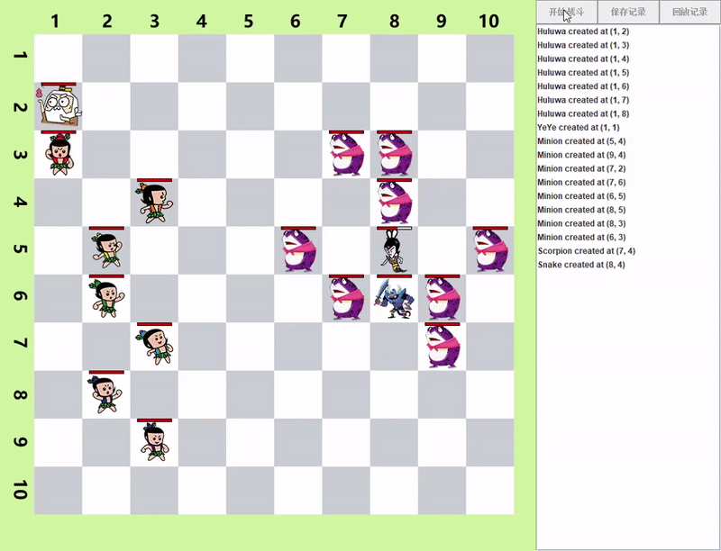
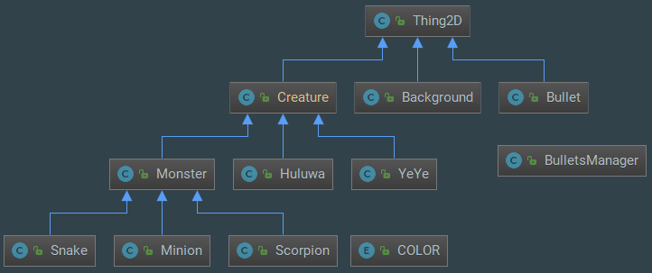
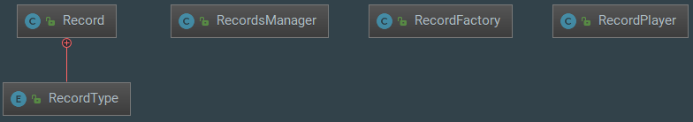
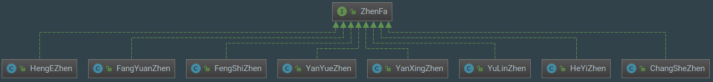

[](https://travis-ci.com/luyiming/huluwa)

# 葫芦娃大战蛇精

A funny project for my **Java course**.

## Screenshots



## Dependencies
This project depends on:
- jdk >= 1.8
- maven >= 4.0.0
- JUnit >= 4.12

## Building huluwa
```
git clone https://github.com/luyiming/huluwa.git
cd huluwa
mvn package
java -cp .\target\huluwa-1.0.jar nju.Main
```

### **最精彩的记录在 `sample-records` 文件夹下**

## Background

### 记录回放
#### 1. 记录
我采用 XML 格式保存游戏记录，所有游戏中发生的事件都作为一条 record 类型的 XML 记录，与代码中的 `class Record` 相对应。下面是一个 XML 记录文件样例：

```xml
<?xml version="1.0" encoding="utf-8" standalone="no"?>
<records>
    <record creature="nju.creature.Minion" id="28" positionX="5" positionY="4" src="hamajing.png" type="CREATE"/>
    <record id="21" time="1" type="MOVE" x="190" y="260"/>
    <record angle="-0.7853981633974483" id="40" src="bullet7.png" time="11" type="BULLET_CREATE" x="120" y="610"/>
    <record id="40" time="29" type="BULLET_MOVE" x="131" y="599"/>
    <record health="0.8" id="21" time="406" type="HURT"/>
    <record id="35" time="2626" type="DEAD"/>
    <record id="217" time="41595" type="BULLET_REMOVE"/>
</records>
```
P.S. 虽然 XML 规范推荐用子节点（sub-node）而不是属性（attribute）来存储信息，但是为了简洁起见，我还是用属性来表示了。

#### 2. 回放
从样例 XML 文件中可以看到，大部分 record 都有一个 time 属性，这正是用来回放战斗过程的关键信息。在代码实现的时候，进行回放操作类的是 `class RecordPlayer exntends Runnable`, 回放的时候，这个类会作为一个独立的线程启动，每隔 20ms 检查一次记录，进行回放操作。

### 继承设计
#### 1. `class Thing2D` 及其子类


`class Thing2D` 表示所有可在界面上绘图的类型，它存储有图像，坐标等信息。其中，所有生物又继承于 `class Creature`，`class Creature` 实现了 `Runnable` 接口，可以作为独立的线程运行。

#### 2. `package record` 及其相关类


与记录回放有关的类都在这个包里

#### 3. `package zhenfa` 及其相关类


所有阵法继承于 `interface zhenfa`，需要实现 `apply` 方法，用于调整队形。

### 工厂方法（Factory method pattern）
因为每个记录的属性很多，我设计了工厂类 `class RecordFactory` 来简化创建记录的操作。

### 模板方法（Template method pattern）
所有生物的基类 `class Creature` 拥有一套完整的行动逻辑，它会根据自身属性（移动速度，子弹数量，攻击力...），不断地进行移动或者攻击操作。其中 `doMove()` 和 `doAttach` 都是可被继承的模板方法。这样，每个子类只需要根据自身特点，重写 `doMove()` 和 `doAttach` 方法就可以进行个性化。
